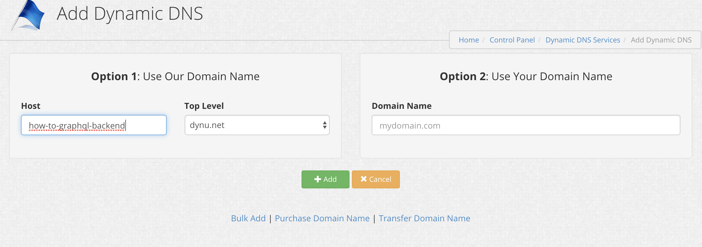

# How-To-GrahpQL by Patrick Riley

This app is a fullstack template for building and deploying a GraphQL app on Digital Ocean with Docker/Docker-Compose. Docker-Compose is also used for local development.

Some technologies used:

- [Prisma2](https://www.prisma.io/blog/announcing-prisma-2-zq1s745db8i5) : Lift for migrations and Photon for type safe database access
- [GraphQL Nexus](https://nexus.js.org/docs/database-access-with-prisma-v2) : GraphQL schema generator / resolver API
- [GraphQL Yoga](https://github.com/prisma/graphql-yoga) : GraphQL server
- [GraphQL Shield](https://github.com/maticzav/graphql-shield): GraphQL permission layer
- [Apollo Client](https://www.apollographql.com/docs/react/) : frontend GraphQL client
- [Next.js](https://nextjs.org/): Build server rendered React UIs that scale with serverless!

This template also ensures that GraphQL schemas have safe type access across the stack.

The following technologies will be coming soon!

- [Dgraph](https://dgraph.io/): Distributed graph database for complex relational queries/relational data

## Contents

- [Running locally](#running-locally)
- [Backend Deployment to Digital Ocean](#backend-deployment-to-digital-ocean)
  - [1. Install Docker and Docker Machine](#1-install-docker-and-docker-machine)
  - [2. Register at Digital Ocean](#2-register-at-digital-ocean)
  - [3. Create your Digital Ocean Droplet](#3-create-your-digital-ocean-droplet)
  - [4. Configure DynuDNS](#4-configure-dynudns)
  - [5. Enable SSH on the Droplet](#5-enable-ssh-on-the-droplet)
  - [6. Reverse Proxy configuration](#6-reverse-proxy-configuration)
  - [7. Install Backend Services on your Droplet with Docker Machine](#7-install-backend-services-on-your-droplet-with-docker-machine)
  - [Handling Errors and Inspecting Logs](#handling-errors-and-inspecting-logs)
- [Frontend Deployment to Zeit](#frontend-deployment-to-zeit)
  - [Prereqs](#prereqs)
  - [Setting DotENV Variables](#setting-dotenv-variables)
  - [Deploy with Now](#deploy-with-now)
  - [SSR and Authentication](#ssr-and-authentication)
- [References](#references)

# Running locally

You can get up and running quickly by entering the following:

```
=> npm run start
```

The only prerequisites are Docker and Node10+.

This template heavily makes use of the guide [here](https://www.codemochi.com/blog/2019-07-10-prisma-2-nextjs-docker) at Code Mochi, so be sure to check out this guide for more details. Some technologies have been forked, but this app shares many of the same core ideas.

# Backend Deployment to Digital Ocean

The following will guide you through deploying your backend to [Digital Ocean](https://digitalocean.com/).

## 1. Install Docker and Docker Machine

The `docker` CLI is a client that allows you to create and manage your Docker containers on a dedicated host machine. By default, that host machine is your local machine (`localhost`). However, using `docker-machine` you can point the docker CLI to run against a different host. Meaning that all your docker commands (including `docker-compose`) can be executed to a remote machine over the internet.

Follow the instructions (steps 1 through 3) at https://docs.docker.com/machine/install-machine/#install-machine-directly to install Docker as well as Docker Machine.

Once you're done, you should be able to run the following command which will output the version of `docker-machine`:

```
docker-machine -v
```

## 2. Register at Digital Ocean

If you haven't already, you need to start by creating an account at DigitalOcean. You can do so here:
https://cloud.digitalocean.com/registrations/new

Once you have your account available, you need to generate a personal access token which can be used to create your Droplet.

Follow the instructions here to obtain your personal access token:
https://docs.docker.com/machine/examples/ocean/#step-2-generate-a-personal-access-token

Make sure to save the token. It will soon disappear after creating it and you'll need it in the next step.

## 3. Create your Digital Ocean Droplet

You can now go ahead and create your Droplet. The personal access token from the previous step will be used to associate the Droplet with your DigitalOcean account.

In your terminal, use `docker-machine` to create your Droplet using the digitalocean driver. Note that you need to replace the `__TOKEN__` placeholder with your personal access token from the previous step:

```
docker-machine create --driver digitalocean --digitalocean-access-token __TOKEN__ --digitalocean-size 2gb prisma2-droplet
```

This will take a few minutes.

The `--digitalocean-size 2gb` argument indicates that the Droplet receives 2GB of memory. The last argument of the command, `prisma2-droplet`, determines the name of the Droplet.

After a few minutes, you should see a running droplet in the Digital Ocean interface:


You will now have a running Droplet that can be controlled by docker-machine. You can list your current Droplets by running the following command:

```
docker-machine ls
```

Record the IP/TCP Address listed. You'll need this in the next step.

## 4. Configure DynuDNS

[DynuDNS](https://www.dynu.com/) is a free service you can use to map IPs to a DNS name. This is required for configuring Let's Encrypt in subsequent steps of this guide. Let's Encrypt will not issue certificates for an IP Address so you'll need a DNS.

Create a free account and once logged in, select the "DDNS Services" panel. Here we will add the Dynamic DNS configuration for your Droplet IP.


On the next screen, hit "Add" to create a new DNS. Once there, create a new DNS mapping. I used the dynu.net top level domain because it's free. For the `host`, you'll want to enter in something you can remember to address each service by, e.g.: `how-to-graphql-backend`



After the new DNS is created, make sure to map it to your IP Address in the IPv4 Address field:


Now all incoming requests to `how-to-graphql-backend.dynu.net` will be dynamically mapped to your Droplet's IP Address. You'll want to repeat the same process for the Prisma Studio UI and Traefik UI so that traffic can easily be visualized in the Traefik Monitor (you'll configure Traefik in future steps). Use the same Droplet IP Address as before but give each service a DNS you can remember. Once finished, you should have three domains mapped like the following (to your droplet's IP):


Before deploying, you'll need to edit the remote HOST labels in `production.yml` so that Traefik can route incoming requests to the appropriate port. This is in the root directory of the project. Be sure to replace all `traefik.frontend.rule=Host:how-to-graphql-[service].dynu.net` labels with your own DNS Host names.

## 5. Enable SSH on the Droplet

This guide is comprehensive and will go ahead and configure HTTPS/TLS out of the box, so in order to do this we'll need to touch a few files on the Droplet.

You can allow remote SSH on the Droplet by first setting a root password in the Digital Ocean Access screen for your droplet. Select "Reset root password" and you'll receive a temporary root password in your email. Then launch the console for your Droplet using the "Launch Console" button on the same Access screen. You'll be prompted to enter the temporary password and then enter a new root password afterward.


Next, to enable SSH access remotely, you can edit the sshd_config file in the console:

```
=> sudo vi /etc/ssh/sshd_config
```

Go to the very bottom of the file (to the line with `PasswordAuthentication`) - Change the value next to PasswordAuthentication from `no` to `yes`. It should now look like this:

```
# Change to no to disable tunnelled clear text passwords
PasswordAuthentication yes
```

Now restart the SSH service:

```
=> sudo service sshd reload
```

You should now be able to login to your Droplet remotely using `ssh root@<your-ip-address>`.

## 6. Reverse Proxy configuration

Next, we'll create the reverse proxy configuration. This guide uses [Traefik](https://traefik.io/) as a reverse proxy and [Lets Encrypt](https://letsencrypt.org/) as a free automated certificate authority. This will give your API services HTTPS/TLS security.

Traefik can be run in a docker container alongside our other containers. But before we get our Traefik container up and running, we need to create a configuration file and set up an encrypted password so we can access the monitoring dashboard.

We'll use the `htpasswd` utility to create this encrypted password. First, install the utility, which is included in the `apache2-utils` package. Once logged in as root, you can install it with:

```
root@prisma:~# sudo apt-get install apache2-utils
```

Then generate the password with `htpasswd`. Substitute `password` with the password you'd like to use for the Traefik admin user:

```
root@prisma:~# htpasswd -nb admin password
```

The output from the program will look like this:

```
admin:$apr1$ruca84Hq$mbjdMZBAG.KWn7vfN/SNK/
```

You'll use this output in the Traefic configuration file to set up HTTP Basic Authentication for the Traefik health check and monitoring dashboard. Copy the entire output line so you can paste it later.

To configure the Traefik server, we'll create a new configuration file called `traefik.toml` using the TOML format. We'll also create an empty file called `acme.json` which will hold our Let's Encrypt information. We'll share this into the container so Traefik can use it.

```
root@prisma:~# mkdir -p /opt/traefik
root@prisma:~# touch /opt/traefik/acme.json && chmod 600 /opt/traefik/acme.json
root@prisma:~# touch /opt/traefik/traefik.toml
```

Next, edit the `/opt/traefik/traefik.toml` file and add the following configuration, ensuring you replace `your_encrypted_password` with your password generated above, and the `email` with your personal email:

```
defaultEntryPoints = ["http", "https"]
[web]
address = ":8080"
  [web.auth.basic]
  users = ["admin:$apr1$RqmHJZzP$Dl5oALb7KbR86AXVa46V8."]
[entryPoints]
  [entryPoints.http]
  address = ":80"
    [entryPoints.http.redirect]
      entryPoint = "https"
  [entryPoints.https]
  address = ":443"
    [entryPoints.https.tls]
[acme]
email = "youremail@you.com"
storage = "acme.json"
entryPoint = "https"
onHostRule = true
onDemand = false
[acme.httpChallenge]
entryPoint = "http"
```

Now you are ready to proceed to install your backend services with Docker Machine.

## 7. Install Backend Services on your Droplet with Docker Machine

The next step is to make sure your docker commands actually run against the remote DigitalOcean Droplet you just created. You can do so by setting a number of environment variables that'll be used by docker. But how do you know which environment variables - and what values to set? `docker-machine` to the rescue!

The following command prints the correct environment variables for you to set - in fact it even prints the commands that you need to execute in your terminal in order to set them correctly. Thank you `docker-machine`!

```
docker-machine env prisma2-droplet
```

The output of that command looks somewhat similar to the following (depending on your shell and OS the commands to set environment variables might differ):

```
| => docker-machine env prisma2-droplet
export DOCKER_TLS_VERIFY="1"
export DOCKER_HOST="tcp://167.71.188.194:2376"
export DOCKER_CERT_PATH="/Users/priley/.docker/machine/machines/prisma2-droplet"
export DOCKER_MACHINE_NAME="prisma2-droplet"
# Run this command to configure your shell:
# eval $(docker-machine env prisma2-droplet)
```

Copy the last line of that output, excluding the # in the beginning (which indicates a comment) and paste it into your terminal:

```
eval $(docker-machine env prisma2-droplet)
```

Additionally, we will need to set `COMPOSE_TLS_VERSION` to `TLSv1_2` for this guide:

```
export COMPOSE_TLS_VERSION=TLSv1_2
```

That's it - all your docker commands will now run against the DigitalOcean Droplet instead of your local machine!

Before we deploy the services, we need to create a Docker network for the reverse proxy to share with containers. The Docker network is necessary so that we can use it with applications that are run using Docker Compose. Let's call this network `proxy`:

```
=> docker network create proxy
```

You should see an output hash after creating the new network.

Now, you can deploy the backend services using `npm run deploy:backend` in this repository, which simply runs our `docker-compose` script on the remote droplet:

```
| => npm run deploy:backend

> docker-prisma@1.0.0 deploy /Users/priley/GitHub/docker-prisma
> docker-compose -f docker-compose.yml -f production.yml up --build -d

Creating network "docker-prisma_internal" with the default driver
Creating volume "docker-prisma_prisma" with default driver
Creating volume "docker-prisma_mysql" with default driver

...

Successfully built 6f3d5fa0fc5b
Successfully tagged docker-prisma_backend:latest
Creating mysql ... done
Creating prisma  ... done
Creating backend ... done
Creating traefik ... done
```

You should now see your docker containers running:

```
| => docker ps
CONTAINER ID        IMAGE                   COMMAND                  CREATED              STATUS              PORTS                                      NAMES
c2a53790575c        traefik:1.5.4           "/traefik --docker"      About a minute ago   Up About a minute   0.0.0.0:80->80/tcp, 0.0.0.0:443->443/tcp   traefik
195cdc78786c        docker-prisma_backend   "docker-entrypoint.s…"   About a minute ago   Up About a minute   0.0.0.0:4000->4000/tcp                     backend
b090e8f87ca2        docker-prisma_prisma    "docker-entrypoint.s…"   About a minute ago   Up About a minute   0.0.0.0:5555->5555/tcp                     prisma
8a715427ee06        mysql:5.7               "docker-entrypoint.s…"   About a minute ago   Up About a minute   0.0.0.0:3306->3306/tcp, 33060/tcp          mysql
```

After deployment you should be able to navigate to the following in your browser:

https://how-to-graphql-backend.dynu.net/ (graphql backend, replace with your own DNS)


https://how-to-graphql-prisma.dynu.net/ (Prisma UI Explorer, replace with your own DNS)


https://how-to-graphql-traefik.dynu.net/ (Traefik Dashboard, replace with your own DNS)

_Note_: you should be prompted for a username and password to login to Traefik Monitoring Dashboard. Use the user/password combination you configured in the `traefik.toml` file above, e.g. user: `admin`, password: `password`.


Traefik Monitoring Dashboard should now show all backend service routes.

You should also see some certificates have been generated in the `/opt/traefik/acme.json` file on your droplet.

Congratulations! You've now successfully deployed the backend GraphQL stack! :tada:

_Note_: before developing locally again, you'll need to unset remote env variables so that you can target Docker on your local machine again. Run the following command to unset (as printed by the output below): `eval $(docker-machine env -u)`

```
| => docker-machine env -u
unset DOCKER_TLS_VERIFY
unset DOCKER_HOST
unset DOCKER_CERT_PATH
unset DOCKER_MACHINE_NAME
# Run this command to configure your shell:
# eval $(docker-machine env -u)
```

You should also unset `COMPOSE_TLS_VERSION` when running locally:

```
unset COMPOSE_TLS_VERSION
```

## Handling Errors and Inspecting Logs

If you see errors in the remote log after running `docker-compose logs`, there are some helpful commands to help you troubleshoot.

```
docker-machine ls ---> (list the docker machine (droplet) you are connected to)
docker-compose logs ---> (list all docker machine logs)
docker-compose ps  ---> (list running containers)
docker ps  ---> (list images)
docker-compose config --services ---> (list services in docker-compose)
docker-compose rm [service-name]  ---> (delete a running service)
```

To remove/redeploy the entire app, you'll want to remove all running containers after stopping them first:

```
docker-compose stop
docker stop traefik
docker-compose rm backend
docker-compose rm prisma
docker-compose rm mysql
docker rm traefik
```

And then redeploy with:

```
npm run deploy:backend
```

If you are debugging locally and running into caching troubles or you are completely stuck, I recommend making sure all containers showing in `docker ps` are stopped (`docker stop [container]`) and then completely cleaning Docker before restarting:

```
npm run stop
npm run clean
npm run clean:volumes
npm run start
```

This will clear all containers and volumes, so be careful about doing this in production, but it should be fine while you are troubleshooting locally and can actually help you find any Docker issues before a release.

To clear docker logs on the remote droplet you can run the following:

```
ssh root@your-ip-address
truncate -s 0 /var/lib/docker/containers/*/*-json.log
```

# Frontend Deployment to Zeit

This guide describes deployment of the frontend Next.js app to Zeit.co serverless lambdas. You can read more about this here:
https://nextjs.org/docs#serverless-deployment

## Prereqs

You'll need to have the Now CLI (and preferably, an existing Zeit account):

```
npm i -g now
```

You can signup for Zeit [here](https://zeit.co/signup).

## Setting DotENV Variables

The frontend container starts automatically with the configuration in `development.yml` and targets `localhost:4000` and `backend:4000` respectively when running server-side in Docker.

Once deployed, however, you'll need to have the `API_HOST` env var set via a _Now Secret_. Example:

```
=> now secrets add api-host https://how-to-graphql-backend.dynu.net
```

And then make sure to add the secret in your `now.json` file:

```
{
  "version": 2,
  "env": {
    "API_HOST": "@api-host"
  }
}
```

More documentation on _Now Secrets_ can be found here:
https://zeit.co/docs/v2/environment-variables-and-secrets#

To emulate production environment locally, you can also set this environment variable in the `frontend/.env` file:

```
API_HOST=https://how-to-graphql-backend.dynu.net
```

However, `process.env` will not be present client-side on the Now serverless Lambda and must be funneled down thru `getInitialProps` which runs server side in Lambda (see `with-apollo-client.js`). More discussion on this [here](https://spectrum.chat/zeit/now/secrets-and-envs-next-serverless~5cd39a82-5f4a-4765-a749-5e71da3fca25?m=MTU0OTczOTk1NDA2MQ==).

Next will automatically set `process.env.NODE_ENV` to `production` once deployed to Zeit.

## Deploy with Now

The Zeit Smart CDN propagates globally and scales frontend deployments automatically. Read more here:
https://zeit.co/smart-cdn

To deploy the frontend to Zeit, simply run `npm run deploy` or `now` from the `frontend/` directory. You should see a live url you can now view the application at. Example:

```
| => npm run deploy

> with-typescript@1.0.0 deploy /Users/priley/GitHub/how-to-graphql/frontend
> now

> Deploying ~/GitHub/how-to-graphql/frontend under priley86
> Using project frontend
> Synced 2 files (3.41KB) [509ms]
> https://frontend-mhxq515bs.now.sh [v2] [1s]
> Ready! Deployed to https://frontend.priley86.now.sh [in clipboard] [48s]
```

Congrats, now your serverless UI is deployed on Zeit!

**Note**: Be sure to "Login" the user before creating drafts. For simplicity of this demo, "Login User" is directly beneath "Create User" so that you can create multiple users quickly.


## SSR and Authentication

You can read more about SSR with Apollo in the docs [here](https://www.apollographql.com/docs/react/features/server-side-rendering/).

Also, authentication in this stack is heavily based on the examples here:
https://github.com/zeit/next.js/tree/canary/examples/with-apollo-auth
https://github.com/prisma/photonjs/tree/master/examples/typescript/graphql-auth

You can read more in the [Apollo Docs](https://www.apollographql.com/docs/react/recipes/authentication/) on authentication.

# References

https://www.howtographql.com/react-apollo/0-introduction/

https://www.prisma.io/tutorials/deploy-prisma-to-digitalocean-with-docker-machine-ct06/

https://www.codemochi.com/blog/2019-07-10-prisma-2-nextjs-docker

https://www.digitalocean.com/community/tutorials/how-to-use-traefik-as-a-reverse-proxy-for-docker-containers-on-ubuntu-16-04

https://docs.traefik.io/user-guide/docker-and-lets-encrypt/

https://www.digitalocean.com/community/questions/error-permission-denied-publickey-when-i-try-to-ssh
